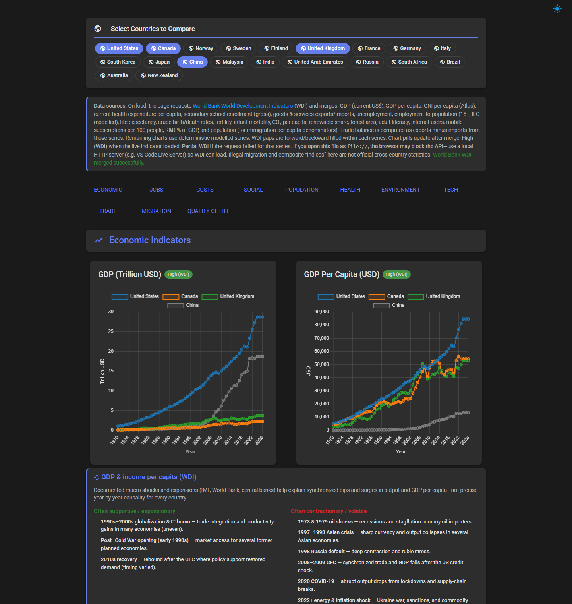

# Global Economic & Social Indicators Dashboard (1970–2026)

An interactive HTML dashboard comparing economic, social, demographic, health, environmental, technology, trade, and migration indicators across many countries. The UI uses Materialize and Chart.js.

## Screenshot

Dark theme (default). The preview is a **fixed viewport** (about 1440×1520px)—not the full scrolling page—so the README stays readable. It shows the country selector, tab bar, **Economic** tab’s first chart row (GDP and GDP per capita), and the **GDP & income per capita (WDI)** context card that belongs with those charts.



## Countries

Selectable chips include (among others): United States, Canada, United Kingdom, France, Germany, Italy, Japan, Norway, Sweden, Finland, South Korea, China, India, Russia, Brazil, Malaysia, UAE, South Africa, New Zealand, and more—see the country row on the page for the full list.

Default selection is typically **United States, Canada, United Kingdom, China** (restored from `localStorage` when present).

## Data sources

- On load, the app requests **World Bank World Development Indicators (WDI)** and merges series where configured (e.g. GDP, GDP per capita, GNI per capita, health expenditure per capita, secondary enrollment, trade, labour, life expectancy, fertility, CO₂, renewables, forest, internet, mobile, R&D, population, and related fields). See the **Data sources** paragraph on the page for the exact list.
- Remaining series use **deterministic modelled** values in-page. Chart **accuracy pills** update after the merge (e.g. High / Partial WDI vs modelled).
- **Important:** Opening the app as `file://` often **blocks** the WDI API. Use a **local HTTP server** (e.g. `python -m http.server` from this folder, or VS Code Live Server) so live data can load.

## Features

- **Tabs:** Economic, Jobs, Costs, Social, Population, Health, Environment, Tech, Trade, Migration.
- **KPI summary**, **year-over-year** tiles, **long-horizon** summaries, and a **comparison table** (latest year).
- **Historical context** under charts (dated episodes) plus a **“Reading the trend (logic)”** block: speculative, logic-only readings from how series move together—not news verification.
- **Dark / light** theme toggle; **dark is the default** (preference stored in `localStorage`).
- **Responsive** layout; chart sizing adjusts with country count and viewport.

## How to run

1. Clone or copy this folder.
2. Start a local server in the project directory, for example:
   `python -m http.server 8765`
   Then open `http://127.0.0.1:8765/` and choose `index.html` if needed.
3. Select countries with the chips and explore the tabs. Hover charts for values.

## Project structure

```
Charts/
├── index.html              # Main dashboard (inline styles & app script)
├── shortcuts.html          # Optional: developer keyboard shortcuts reference (standalone)
├── dashboard-screenshot.png  # README preview: dark theme, first Economic section (viewport crop)
├── README.md               # This file
└── .gitignore              # Ignores IDE/OS noise and common local artifacts
```

## License / use

Indicators labelled as modelled or low-accuracy are **illustrative**. Use official national statistics and WDI documentation for policy or research. Migration “illegal” and some composite indices are **not** official cross-country statistics.
